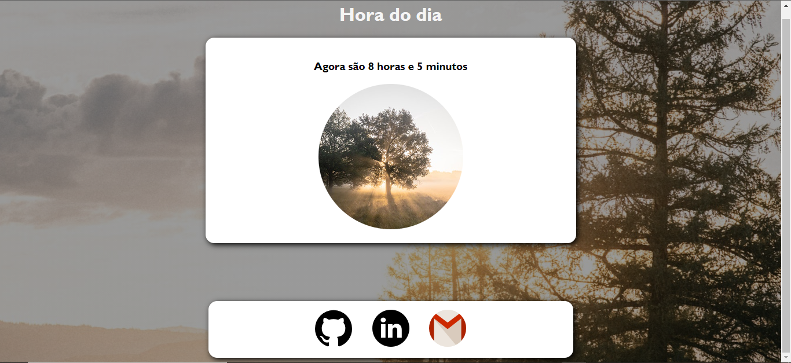
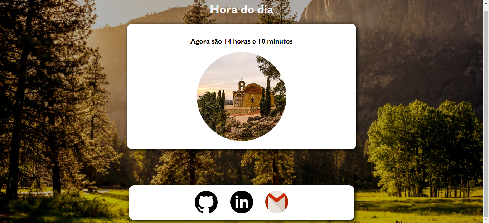
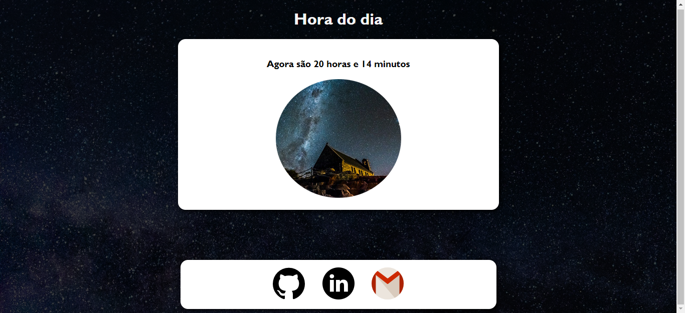

<h1>Hora do Dia</h1>

<!-- FOTOS -->

    <h2> 📸 Fotos </h2>
        
          
        
          
        
        <br 

<!-- LINKS -->

    <h3>Link do Projeto <a href="https://lucasfrancobn.github.io/Hora-do-Dia/">CLIQUE AQUI</a></h3>
    <a href="#sobre">Sobre o Projeto</a> - 
    <a href="#tec">Tecnologias</a>

 

<!-- SOBRE -->

    <h2> 📝 Sobre o Projeto </h2> 
    
 Projeto pensado para mostrar as <strong>Horas</strong> e <strong>Minutos</strong> locais. Se a hora local estiver entre 00:00 e 12:00, mostrará uma imagem representando a manhã, além do fundo do site mudar também; caso a hora local estiver entre 12:00 e 18:00, mostrará uma imagem representando o entardecer, o fundo da página também será alterado; em último caso, se o horário local estiver entre 18:00 e 00:00, mostrará uma imagem representando a noite, o fundo da página também será alterado 

 

<!-- TECNOLOGIAS -->

<h2> 🖥️ Tecnologias </h2>
    
 ✔️ HTML 5 

    
 ✔️ CSS 3 

    
 ✔️ JavaScript 

